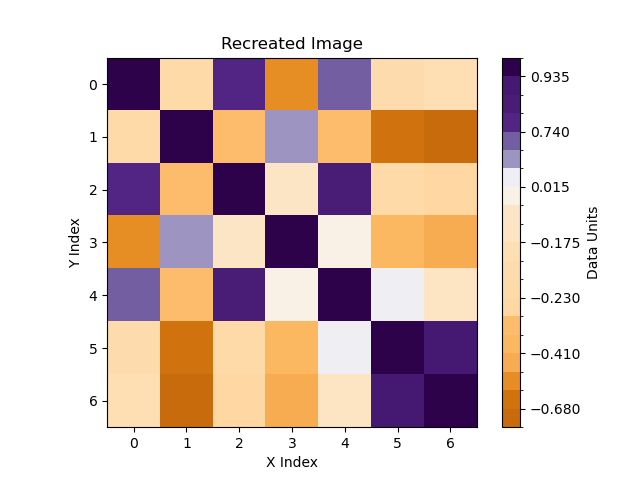

# Digitize Gridded Data in Images

This code analyzes the color values in an image and, using a colormap, converts them
back to data space.
The use case is analogous to plot digitizers that convert data from graphs or maps back
into data space - here, we work with colors instead.

## Prerequisites

Install the packages from `requirements.txt`, e.g. into a new conda environment like this:

    conda env create -n digitize -f requirements.txt

## Usage

`digitize_gridded_image.py` is a standalone script. Call it without any arguments to
display the usage message:

    > python digitize_gridded_image.py

    usage: digitize_gridded_image.py [-h] [--recreate-image RECREATE_IMAGE] [--ignore-black IGNORE_BLACK] filename data_box legend_box markers_pixel markers_data nx ny output_name

    Extract data from an image and colorbar.

    positional arguments:
      filename              Filename of image.
      data_box              JSON-formatted string of (inclusive) pixel boundary coordinates of the data in the order [left, top, right, bottom].
      legend_box            JSON-formatted string of (inclusive) pixel boundary coordinates of the colorbar in the order [left, top, right, bottom]; note that either left=right or     top=bottom.
      markers_pixel         JSON-formatted string of ascending pixel coordinates of the tick labels (x coordinates if colorbar horzontal, y otherwise).
      markers_data          JSON-formatted string of data values of the tick labels.
      nx                    Number of data grid points in the x direction.
      ny                    Number of data grid points in the y direction (defaults to `nx`).
      output_name           Output filename for data with either `.npy` or `.txt` extension.

    options:
      -h, --help            show this help message and exit
      --recreate-image RECREATE_IMAGE
                            If provided, also save a debugging image with the extracted colors to the specified filename.
      --ignore-black IGNORE_BLACK
                            When extracting the dominant colors, ignore pixels this far away in RGB space from true black using Euclidean 3D distances.

## Example

Suppose you want to get the data from a plot like the bottom right one one in this [Matplotlib
example](https://matplotlib.org/3.8.2/gallery/images_contours_and_fields/image_annotated_heatmap.html),
section *Some more complex heatmap examples*.
We want to analyze each colored patch on the grid and then use the provided colormap to estimate what
value was used to generate the color for the patch.
Running the example script and saving the last plot as a file gives this figure:

We then need the pixel coordinates for the data and the colorbar, which we can get e.g. using Matplotlib:

    python -c "import matplotlib.pyplot as plt; from PIL import Image; plt.imshow(Image.open('image_in.png')); plt.show()"

Zooming in and out and moving the mouse coordinates we find the following:

- The bounding box for the data is `[left=498, top=379, right=693, bottom=574]`.
- One line on the the colorbar is `[715, 377, 715, 577]`.
- The markers on the colorbar are at the y pixel coordinates `[377, 427, 477, 527, 577]`.
- The markers on the colorbar represent the values `[1, 0.5, 0, -0.5, -1]`.
- We count `nx=7` and `ny=7` patches in the x and y directions, respectively.

With that, we have all we need to run the script:

    python digitize_gridded_image.py image_in.png "[498, 379, 693, 574]" "[715, 377, 715, 577]" "[377, 427, 477, 527, 577]" "[1, 0.5, 0, -0.5, -1]" 7 7 data_out.txt --recreate-image=image_out.png

Which yields the following recreated image:

Which looks pretty much exactly like the input file. The colorbar has a different progression, but that's because it's based only on recognized colors
and doesn't include any assumptions about the linearity of the input colormap.

The data values we get (in `data_out.txt`) are:

|     |      |      |      |      |      |      |
|-----|------|------|------|------|------|------|
| 0.99| -0.22|  0.82| -0.55|  0.66| -0.21| -0.2 |
|-0.22|  0.99| -0.37|  0.49| -0.37| -0.66| -0.7 |
| 0.82| -0.37|  0.99| -0.14|  0.86| -0.22| -0.24|
|-0.55|  0.49| -0.14|  0.99| -0.04| -0.39| -0.43|
| 0.66| -0.37|  0.86| -0.04|  0.99|  0.07| -0.15|
|-0.21| -0.66| -0.22| -0.39|  0.07|  0.99|  0.88|
|-0.2 | -0.7 | -0.24| -0.43| -0.15|  0.88|  0.99|

which are pretty close to the true values (which are kindly included in the Matplotlib
example figure).

This also works for categorical data, e.g.:

    python digitize_gridded_image.py image_in.png "[117, 379, 313, 574]" "[335, 377, 335, 577]" "[390, 419, 448, 477, 506, 535, 564]" '["A", "B", "C", "D", "E", "F", "G"]' 6 6 data_out_cat.txt --recreate-image=image_out_cat.png

Yielding the data

|   |   |   |   |   |   |
|---|---|---|---|---|---|
| E | E | C | E | D | D |
| C | F | D | E | C | C |
| C | D | C | E | D | D |
| G | E | D | D | D | B |
| D | D | C | B | E | C |
| C | C | E | B | E | B |

and the image

Finally, the option `--ignore-blacks` is present for cases where the colored grid data is overlain
by other elements like lines or text that make it harder for the algorithm to extract the dominant
color. Those elements are often in shades of black / dark grey and can be ignored from the
estimation. This however only works if the colorbar itself doesn't include dark colors.

## Acknowledgments

Part of this code is copied from [StackOverflow](https://stackoverflow.com/a/30305181/13054094)
under the CC-BY-SA-3.0 license.
